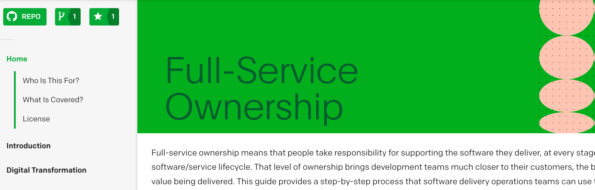

# PagerDuty Full Service Ownership Documentation

This guide documents a collection of leading practices for empowering engineers to own their code and services in production. It teaches you how to develop the right culture to implement full-service owenrship strategies, and how to foster an environment of accountability with high quality code.

You can view the documentation directly in this repository, or rendered as a website at https://ownership.pagerduty.com.

## Development
We use [MkDocs](http://www.mkdocs.org/) to create a static site from this repository. For local development,

1. Install v0.1.0 of [MkDocs Bootswatch](https://github.com/mkdocs/mkdocs-bootswatch) `pip install mkdocs-bootswatch==0.1.0`
1. Install v0.1.1 of [MkDocs Bootstrap](https://github.com/mkdocs/mkdocs-bootstrap) `pip install mkdocs-bootstrap==0.1.1`
1. Install v0.15.3 of [MkDocs](http://www.mkdocs.org/#installation). `pip install mkdocs==0.15.3`
1. Install v0.2.4 of the [MkDocs Material theme](https://github.com/squidfunk/mkdocs-material). `pip install mkdocs-material==0.2.4`
1. Install [MkDocs PyMdown Extensions](https://squidfunk.github.io/mkdocs-material/extensions/pymdown/). `pip install pymdown-extensions`
1. To test locally, run `mkdocs serve` from the project directory.

### Docker Option
From the root directory of this repo...
1. `docker build -t mkdocs .`
1. ``docker run -v `pwd`:/docs/ -p 8080:8080 mkdocs``
1. Open `http://localhost:8080` to see changes in your browser

## Deploying
1. Run `mkdocs build --clean` to produce the static site for upload.
1. Upload the `site` directory to S3 (or wherever you would like it to be hosted).

        aws s3 sync ./site/ s3://[BUCKET_NAME] \
          --acl public-read \
          --exclude "*.py*" \
          --delete

## License
[Apache 2](http://www.apache.org/licenses/LICENSE-2.0) (See [LICENSE](LICENSE) file)

## Contributing
Thank you for considering contributing! If you have any questions, just ask - or submit your issue or pull request anyway. The worst that can happen is we'll politely ask you to change something. We appreciate all friendly contributions.

Here is our preferred process for submitting a pull request,

1. Fork it ( https://github.com/PagerDuty/retrospectives-docs/fork )
1. Create your feature branch (`git checkout -b my-new-feature`)
1. Commit your changes (`git commit -am 'Add some feature'`)
1. Push to the branch (`git push origin my-new-feature`)
1. Create a new Pull Request.
